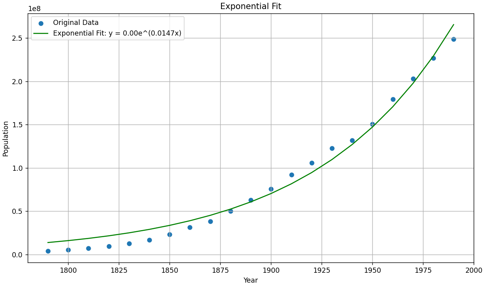
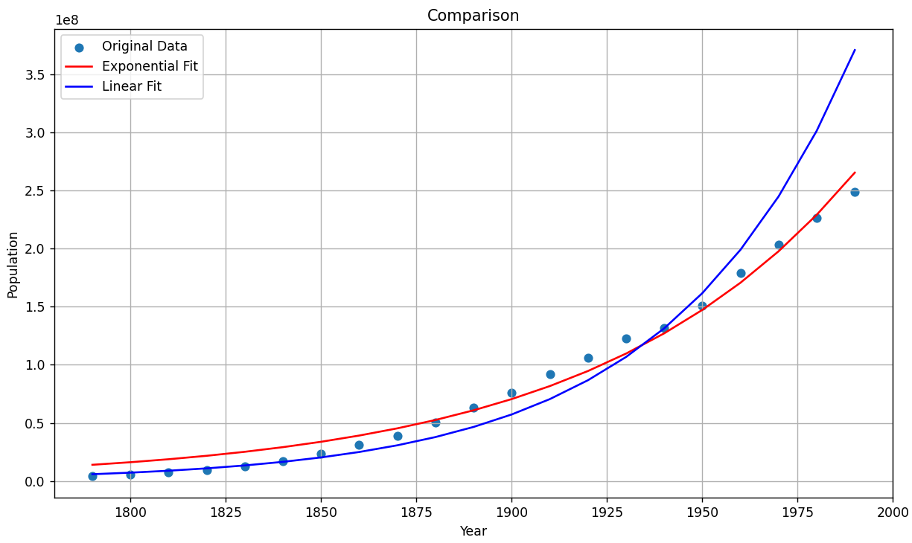
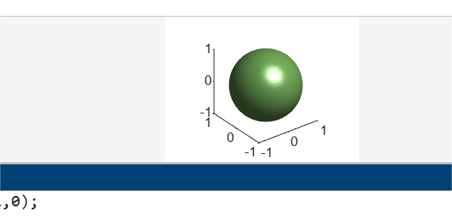

## 跨入科学研究之门-计算机应用
### Final Exam Part2
### 21307130096 王芃骁
#### Q1
- Notes：uspop文本文件一定需要与Q1.py文件放在同一个目录下，否则需要自己修改代码。
- 线性拟合截图：

- 指数拟合截图：

- 转化后拟合截图：

- 代码如下：
```
import numpy as np
import matplotlib.pyplot as plt
from scipy.stats import linregress
from scipy.optimize import curve_fit

# 读取数据
data = np.loadtxt('uspop.txt')
x = data[:, 0]  # 年份
y = data[:, 1]  # 人口数

# 对年份数据进行缩放（例如，减去最小年份）
x_scaled = x - x.min()

# 线性拟合
slope, intercept, _, _, _ = linregress(x_scaled, y)
y_linear_fit = slope * x_scaled + intercept

# 绘制线性拟合结果
plt.figure(figsize=(10, 6))
plt.grid(True)
plt.plot(x, y, 'o', label='Original Data')
plt.plot(x, y_linear_fit, 'r', label=f'Linear Fit: y = {slope:.2f}x + {intercept:.2f}')
plt.xlabel('Year')
plt.ylabel('Population')
plt.title('Linear Fit')
plt.legend()
plt.tight_layout()
plt.show()

# 指数拟合函数
def exponential_fit(x, a, c):
    return a * np.expm1(c * x)

x_normalized = x / 500.0  
y_normalized = y / 1e7    

popt_normalized, pcov_normalized = curve_fit(exponential_fit, x_normalized, y_normalized)

a_normalized, c_normalized = popt_normalized
a = a_normalized * 1e7  
c = c_normalized / 500.0  

exponential_fit_values = exponential_fit(x, a, c)

plt.figure(figsize=(10, 6))
plt.grid(True)
plt.scatter(x, y, label='Original Data')
plt.plot(x, exponential_fit_values, label=f'Exponential Fit: y = {a:.2f}e^({c:.4f}x)', color='green')
plt.xlabel('Year')
plt.ylabel('Population')
plt.legend()
plt.title('Exponential Fit')
plt.tight_layout()
plt.show()

#转化成线性回归
log_y = np.log(y)
slope_log, intercept_log, r_value_log, p_value_log, std_err_log = linregress(x, log_y)
exponential_fit_linear_transform = np.exp(intercept_log) * np.exp(slope_log * x)

plt.figure(figsize=(10, 6))
plt.grid(True)
plt.scatter(x, y, label='Original Data')
plt.plot(x, exponential_fit_values, label='Exponential Fit', color='red')
plt.plot(x, exponential_fit_linear_transform, label='Linear Fit', color='blue')
plt.xlabel('Year')
plt.ylabel('Population')
plt.legend()
plt.title('Comparison')
plt.tight_layout()
plt.show()
```
#### Q2
1. 
```
[x,y,z]=meshgrid(-1:0.1:1); isosurface(x,y,z,x.^2+y.^2+z.^2-1,0); axis equal; colormap summer
```

2. 
```
[x,y,z] = meshgrid(-1:0.1:1,-1:0.1:1,-1:0.1:1); a = 2; b = 1; V = (x.^2/a^2 + y.^2/b^2 + z.^2/b^2); isosurface(x,y,z,V,1); axis equal; colormap([1 0 0])
```

#### Q3
```
Input:
Integrate[(Sin[x] - Sin[3*x] + Sin[5*x])/(Cos[x] + Cos[3*x] + Cos[5*x]),x]
Output:
-Log(Cos[x])
```

#### Q4
- 渲染后效果如下：
# Lorenz Attractor

The Lorenz attractor is an [attractor](https://mathworld.wolfram.com/Attractor.html) that arises in a simplified system of equations describing the two-dimensional flow of fluid. In the early 1960s, Lorenz accidentally discovered the chaotic behavior of this system when he found that, for a simplified system, periodic solutions of the form

$$\psi = \psi_0 \sin\left(\frac{\pi ax}{H}\right)\sin\left(\frac{\pi z}{H}\right)$$

$$\theta = \theta_0 \cos\left(\frac{\pi ax}{H}\right)\sin\left(\frac{\pi z}{H}\right)$$

grew for Rayleigh numbers larger than the critical value, $Ra>Ra_c$. Furthermore, vastly different results were obtained for very small changes in the initial values, representing one of the earliest discoveries of the so-called [butterfly effect](https://mathworld.wolfram.com/ButterflyEffect.html).

Lorenz obtained the simplified equations

$$\dot{X} = \sigma(Y-X)$$

$$\dot{Y} = X(\rho-Z)-Y$$

$$\dot{Z} = XY-\beta Z$$

now known as the Lorenz equations.
- 源码如下：
```
# Lorenz Attractor

The Lorenz attractor is an [attractor](https://mathworld.wolfram.com/Attractor.html) that arises in a simplified system of equations describing the two-dimensional flow of fluid. In the early 1960s, Lorenz accidentally discovered the chaotic behavior of this system when he found that, for a simplified system, periodic solutions of the form

$$\psi = \psi_0 \sin\left(\frac{\pi ax}{H}\right)\sin\left(\frac{\pi z}{H}\right)$$

$$\theta = \theta_0 \cos\left(\frac{\pi ax}{H}\right)\sin\left(\frac{\pi z}{H}\right)$$

grew for Rayleigh numbers larger than the critical value, $Ra>Ra_c$. Furthermore, vastly different results were obtained for very small changes in the initial values, representing one of the earliest discoveries of the so-called [butterfly effect](https://mathworld.wolfram.com/ButterflyEffect.html).

Lorenz obtained the simplified equations

$$\dot{X} = \sigma(Y-X)$$

$$\dot{Y} = X(\rho-Z)-Y$$

$$\dot{Z} = XY-\beta Z$$

now known as the Lorenz equations.
```
